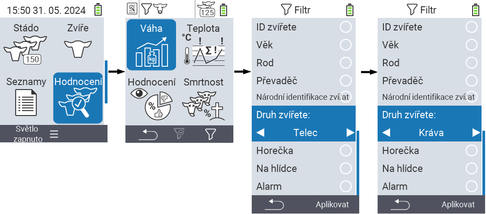
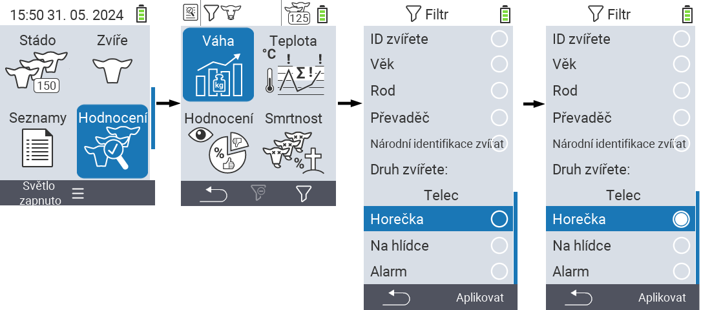

## Použití filtrů {#applying-filters}

{}
Filtr vám pomůže provést výběr pomocí kritérií filtru v položkách menu `Stádo`, `Seznamy` a `Hodnocení` zařízení VitalControl. Jakmile použijete filtr, na horní části obrazovky se objeví symboly pro různá kritéria filtru. Tyto symboly vám pomohou zjistit, zda a která kritéria filtru jsou aktivována. Například pokud nastavíte filtr `Pohlaví` na mužské, zařízení bude používat pouze mužská zvířata. Pokud také aktivujete filtr `Na pozorování`, zařízení použije pouze mužská zvířata, která jsou na seznamu pozorování.
{}

Chcete-li vytvořit filtr v hodnoceních, postupujte následovně:

1. V podmenu patřícím k horní položce menu  `Hodnocení` stiskněte jednou klávesu `F3` . V podmenu patřícím k horním položkám menu  `Seznamy` a  `Stádo` musíte stisknout klávesu dvakrát.

2. Otevře se podmenu, ve kterém můžete nastavit všechny možnosti filtru. Můžete filtrovat podle `ID zvířete`, `Věk`, `Pohlaví`, `Transpondér`, `Národní ID zvířete`, `Horečka`, `Na pozorování`, `Typ zvířete` a `Alarm`.

3. Pro filtry `Typ zvířete`, `Pohlaví`, `Transpondér` a `Národní ID zvířete` přejděte do odpovídající oblasti a potvrďte `OK`. Pomocí šipek ◁ ▷ určete požadované nastavení. Použijte klávesu `F3` `Použít` k uplatnění vybraného nastavení. Chcete-li zrušit změny filtru, stiskněte klávesu `F1` &nbsp;&nbsp;.

4. Pro filtry `ID zvířete` a `Věk` vyberte odpovídající kritérium a potvrďte stisknutím `OK`. Nyní se vám zobrazí dolní a horní limit. Pomocí šipek △ ▽ přejděte na požadovaný limit a potvrďte stisknutím `OK` dvakrát. Nyní můžete nastavit požadované číslo pomocí šipek ◁ ▷ a šipek △ ▽. Jakmile jsou všechna nastavení správná, stiskněte znovu `OK` pro opuštění režimu nastavení a použijte vybraný filtr(y) pomocí klávesy `F3` `Použít`. Pomocí klávesy `F1` &nbsp;&nbsp; můžete v případě potřeby zrušit své změny.

5. Pro filtry `Horečka`, `Na pozorování` a `Alarm` je možnost zakázat nebo povolit jejich použití. K tomu vyberte odpovídající filtr a potvrďte stisknutím `OK`. Filtr je nyní aktivní. Potvrďte znovu stisknutím `OK` pro deaktivaci filtru.

6. Jakmile nastavíte všechny filtry, použijte klávesu `F3` `Použít` pro aplikaci definovaných filtrů nebo stiskněte klávesu `F1`  pro zrušení změn filtrů.
