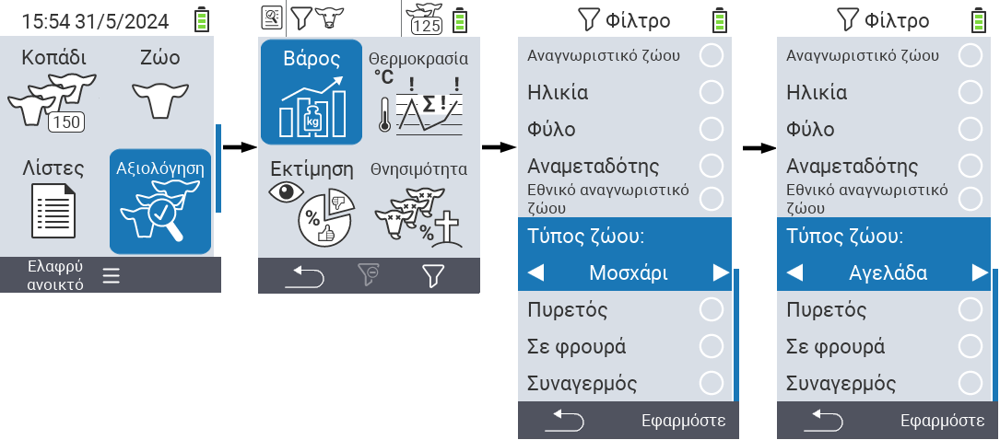

## Εφαρμογή φίλτρων {#applying-filters}

{}
Το φίλτρο σας βοηθά να πραγματοποιήσετε μια επιλογή χρησιμοποιώντας κριτήρια φιλτραρίσματος μέσα στα στοιχεία του μενού ``, `` και `` της συσκευής VitalControl. Μόλις εφαρμόσετε ένα φίλτρο, σύμβολα για τα διάφορα κριτήρια φιλτραρίσματος εμφανίζονται στο επάνω μέρος της οθόνης. Αυτά τα σύμβολα χρησιμοποιούνται για να σας βοηθήσουν να καταλάβετε αν και ποια κριτήρια φιλτραρίσματος είναι ενεργοποιημένα. Για παράδειγμα, αν ορίσετε το φίλτρο `` σε αρσενικό, η συσκευή θα χρησιμοποιήσει μόνο αρσενικά ζώα. Για παράδειγμα, αν ενεργοποιήσετε επίσης το φίλτρο ``, η συσκευή χρησιμοποιεί μόνο αρσενικά ζώα που βρίσκονται στη λίστα παρατήρησης.
{}

Για να δημιουργήσετε ένα φίλτρο στις αξιολογήσεις, προχωρήστε ως εξής:

1. Στο υπομενού που ανήκει στο κορυφαίο στοιχείο μενού  `` πατήστε το κλειδί `F3`  μία φορά. Μέσα στο υπομενού που ανήκει στα κορυφαία στοιχεία μενού  `` και  ``, πρέπει να πατήσετε το κλειδί δύο φορές.

2. Ανοίγει ένα υπομενού στο οποίο μπορείτε να ρυθμίσετε όλες τις επιλογές φιλτραρίσματος. Μπορείτε να φιλτράρετε ανά ``, ``, ``, ``, ``, ``, ``, `` και ``.

3. Για τα φίλτρα ``, ``, `` και `` πλοηγηθείτε στην αντίστοιχη περιοχή και επιβεβαιώστε με ``. Χρησιμοποιήστε τα πλήκτρα βέλους ◁ ▷ για να καθορίσετε την επιθυμητή ρύθμιση. Χρησιμοποιήστε το κλειδί `F3` `` για να τεθεί σε ισχύ η επιλεγμένη ρύθμιση. Για να απορρίψετε τις αλλαγές στο φίλτρο σας, πατήστε το κλειδί `F1` &nbsp;&nbsp;.

4. Για τα φίλτρα `` και `` επιλέξτε το αντίστοιχο κριτήριο και επιβεβαιώστε με ``. Θα σας εμφανιστούν τώρα ένα κάτω και ένα άνω όριο. Πλοηγηθείτε στο επιθυμητό όριο χρησιμοποιώντας τα βελάκια △ ▽ και επιβεβαιώστε πατώντας `` δύο φορές. Τώρα μπορείτε να ορίσετε τον επιθυμητό αριθμό χρησιμοποιώντας τα βελάκια ◁ ▷ και τα βελάκια △ ▽. Μόλις όλες οι ρυθμίσεις είναι σωστές πατήστε ξανά `` για να φύγετε από τη λειτουργία ρύθμισης και να εφαρμόσετε το επιλεγμένο φίλτρο(α) με το κλειδί `F3` ``. Χρησιμοποιώντας το κλειδί `F1` &nbsp;&nbsp;, μπορείτε να απορρίψετε τις αλλαγές σας αν το επιθυμείτε.

5. Για τα φίλτρα ``, `` και `` υπάρχει η δυνατότητα να απενεργοποιήσετε ή να ενεργοποιήσετε την εφαρμογή τους. Για να το κάνετε αυτό, επιλέξτε το αντίστοιχο φίλτρο και επιβεβαιώστε με ``. Το φίλτρο είναι τώρα ενεργό. Επιβεβαιώστε ξανά με `` για να απενεργοποιήσετε το φίλτρο.

6. Αφού έχετε ορίσει όλα τα φίλτρα, χρησιμοποιήστε το κλειδί `F3` `` για να τεθούν σε ισχύ τα ορισμένα φίλτρα ή πατήστε το κλειδί `F1`  για να απορρίψετε τις αλλαγές στα φίλτρα.
