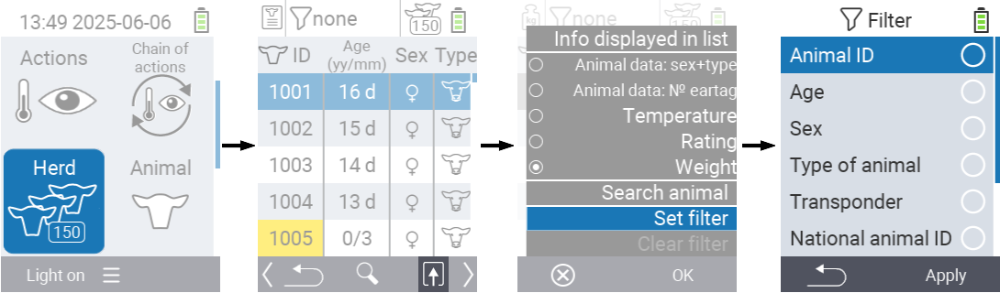
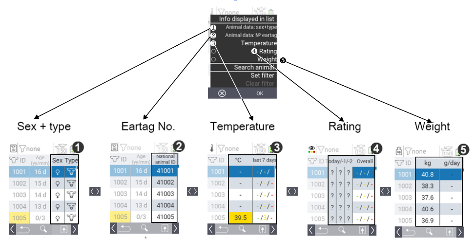

In this menu you have the following possibilities:

- Perfom an [action](#call-action-menu) for the selected animal 
- [Search](#search-for-an-animal) or [filter](#apply-a-filter) animals  
- [Configure display settings](#configure-display-settings) 

<figure class="figure" style="margin-top: 5px;">
    
    <figcaption class="figure-caption fs-6"> Figure 1: Available options in Herd menu</figcaption>
</figure>

<map name="FigureOverviewMap">
    <area shape="rect" coords="0,430,240,783" alt='' title='' href="#call-action-menu">
    <area shape="rect" coords="312,430,550,783" alt='' title='' href="#search-for-an-animal">
    <area shape="rect" coords="625,380,862,783" alt='' title='' href="#configure-display-settings">
</map>

### Call action menu {#call-action-menu}

You always have the option to call up the action menu for an animal.

1. On the main screen of your  device, select the menu item &nbsp;&nbsp; `` and press the `` button. Your herd overview opens.

2. Select an animal from the list with the arrow keys △ ▽ and confirm with ``. The action menu is now open. How to use this can be found [here](../actions).

4. Return to the herd list with the `F1`  &nbsp;&nbsp; key.

    

### Search or filter animals {#search-or-filter-animals}

It is also possible to search for a specific animal or set a filter.

* `` 

    Search for an animal allows you to search for an animal number using the arrow keys △ ▽ ◁ ▷. For more information about `` see [here]().

* `` 

    You can use the filter to limit which animals are displayed in the selection list. For more information about `` see [here]().

<figure class="figure" style="margin-top: 5px;">
    
    <figcaption class="figure-caption fs-6">Figure 2: Search and set filter</figcaption>
</figure>

#### Search for an animal

1. On the main screen of your  device, select the menu item &nbsp;&nbsp; `` and press the `` button. Your herd overview opens.

1. Use the `F2` &nbsp;&nbsp; to get to the search input. Alternatively use the `F3` key &nbsp;&nbsp; to invoke the popup menu that lists all the available options. Use the arrow keys △ ▽ to highlight `` and press the central `` button or the `F3` key ``.

1. Further information about the search input can be found [here]().



{}

{}
{}

{}


#### Apply a filter

1. On the main screen of your  device, select the menu item &nbsp;&nbsp; `` and press the `` button. Your herd overview opens.

1. Use the `F3` key &nbsp;&nbsp; to invoke the popup menu that lists all the available options. Use the arrow keys △ ▽ to highlight `` and press the central `` button or the `F3` key ``.

1. Further information about filter can be found [here](../filter/_index.md).

### Configure display settings  {#configure-display-settings}

Within the herd menu, you have several options to display the information of your animals in short form. All options are shown in [Figure 3](#Figure3) below.

* `` 

    Under ``, the two columns on the right show you both the sex and the type (cow, calf, sheep, lamb) of the respective animal.

* `` 

    Under ``, the right column show you the National animal ID of the respective animal.

* `` 

    When you select ``, the last measured temperature of the animal is displayed in the middle column. The right-hand column shows you how often which temperature category was measured for the respective animal in the last seven days.

* `` 

    By selecting ``, the most recent rating and the last two past ratings are displayed in the middle column. In the right-hand column you will find the frequencies of the respective score.

* `` 

    With selecting ``, the last recorded weight of the animal is displayed in the middle column. In the right-hand column you will find the daily weight gain.

<figure class="figure" style="margin-top: 5px;">
    
    <figcaption class="figure-caption fs-6">Figure 3: Available information display in Herd menu</figcaption>
</figure>

To display the desired information, proceed as follows:

1. On the main screen of your  device, select the menu item &nbsp;&nbsp; `` and press the `` button. Your herd overview opens.

1. Use the `F3` key &nbsp;&nbsp; to invoke the popup menu that lists the information categories. Use the arrow keys △ ▽ to highlight your desired selection and display this category by pressing the central `` button or the `F3` key ``.

1. Alternatively, you can use the arrow keys ◁ ▷ to switch between the different display options.



{}

{}
{}

{}
{}

{}
{}

{}
{}

{}

