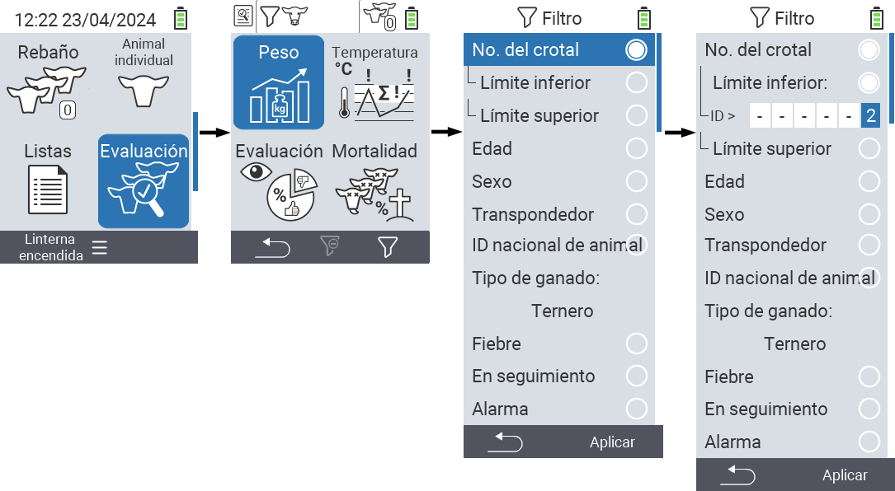
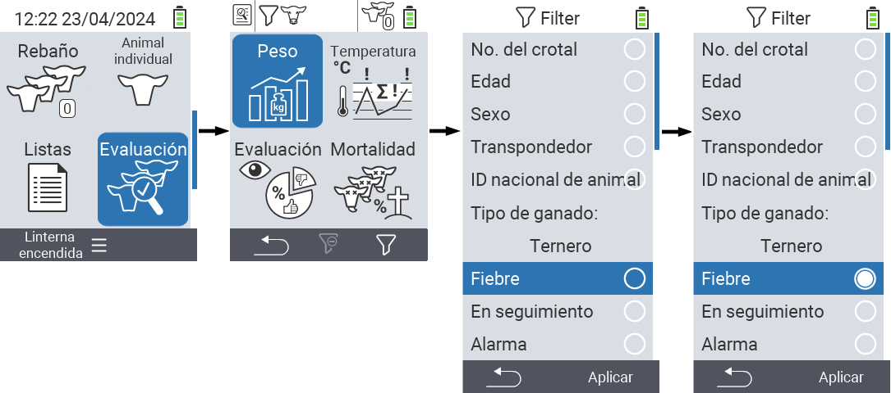

## Aplicando filtros {#applying-filters}

{}
El filtro te ayuda a realizar una selección usando criterios de filtro dentro de los elementos del menú `Hato`, `Listas` y `Evaluación` del dispositivo VitalControl. Tan pronto como apliques un filtro, aparecerán símbolos para los diversos criterios de filtro en la parte superior de la pantalla. Estos símbolos se utilizan para ayudarte a saber si se activaron criterios de filtro y cuáles. Por ejemplo, si configuras el filtro `Sexo` a masculino, el dispositivo solo usará animales machos. Por ejemplo, si también activas el filtro `En observación`, el dispositivo solo usará animales machos que están en la lista de observación.
{}

Para crear un filtro en las evaluaciones, procede de la siguiente manera:

1. En el submenú perteneciente al elemento del menú superior  `Evaluación` presiona la tecla `F3`  una vez. Dentro del submenú perteneciente a los elementos del menú superior  `Listas` y  `Rebaño`, tienes que presionar la tecla dos veces.

2. Se abre un submenú en el que puedes configurar todas las opciones de filtro. Puedes filtrar por `No. del crotal`, `Edad`, `Sexo`, `Transpondedor`, `ID nacional de animal`, `Fiebre`, `En seguimiento`, `Tipo de ganado` y `Alarma`.

3. Para los filtros `Tipo de ganado`, `Sexo`, `Transpondedor` y `ID nacional de animal` navega hasta el área correspondiente y confirma con `OK`. Usa las teclas de flecha ◁ ▷ para especificar la configuración deseada. Usa la tecla `F3` `Aplicar` para poner en marcha la configuración seleccionada. Para descartar los cambios en el filtro, presiona la tecla `F1` &nbsp;&nbsp;.

4. Para los filtros `ID de animal` y `Edad` selecciona el criterio correspondiente y confirma con `OK`. Ahora se te mostrarán un límite inferior y superior. Navega hasta el límite deseado usando las teclas de flecha △ ▽ y confirma presionando `OK` dos veces. Ahora puedes establecer el número deseado usando las teclas de flecha ◁ ▷ y las teclas de flecha △ ▽. Una vez que todos los ajustes sean correctos, presiona `OK` nuevamente para salir del modo de configuración y aplicar el(los) filtro(s) seleccionado(s) con la tecla `F3` `Aplicar`. Usando la tecla `F1` &nbsp;&nbsp;, puedes descartar tus cambios si lo deseas.

5. Para los filtros `Fiebre`, `En seguimiento` y `Alarma` hay una posibilidad de deshabilitar o habilitar su aplicación. Para hacer esto, selecciona el filtro correspondiente y confirma con `OK`. El filtro ahora está activo. Confirma de nuevo con `OK` para desactivar el filtro.

6. Una vez que hayas configurado todos los filtros, usa la tecla `F3` `Aplicar` para poner en marcha los filtros definidos o presiona la tecla `F1`  para descartar tus cambios en el(los) filtro(s).
