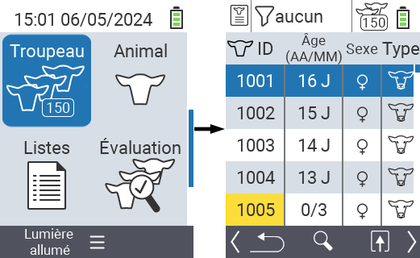
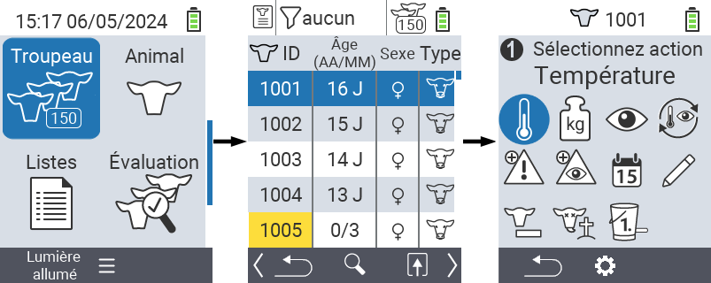

## Troupeau {#herd}

Dans l'élément de menu Troupeau, vous pouvez voir l'ensemble de votre troupeau, rechercher des animaux individuels et afficher des informations importantes. Vous avez les possibilités suivantes :

- Voir [les données animales](#voir-les-données-animales)
- Voir [les données de température](#afficher-la-température)
- Voir [les données de classement](#voir-évaluation)
- Voir [les données de poids](#afficher-poids)
- [Rechercher un animal](#rechercher-animal)
- Définir un [filtre](#définir-un-filtre)
- [Actions](#appeler-le-menu-daction)

### Étapes préparatoires {#preparatory-steps}

1. Sur l'écran principal de votre appareil VitalControl, sélectionnez l'élément de menu  `Troupeau` et appuyez sur le bouton `OK`.

2. Votre aperçu du troupeau s'ouvre.

    

### Voir les données animales {#view-animal-data}

1. Complétez les étapes préparatoires.

2. Utilisez la touche `F3` &nbsp;&nbsp; pour invoquer un menu popup qui liste les catégories d'informations qui peuvent être affichées pour la liste du troupeau. Utilisez les touches fléchées △ ▽ pour mettre en surbrillance la ligne `Données animales : sexe + type` ou `Données animales : N0 boucle d'oreille` et sélectionnez cette catégorie en appuyant sur le bouton central `OK` ou la touche `F3` `OK`. Les deux options de sélection diffèrent dans l'affichage de la barre d'informations.

3. Les données animales seront maintenant affichées comme contenu de la liste du troupeau.

4. Alternativement, vous pouvez utiliser les touches fléchées ◁ ▷ pour passer entre les différentes options d'affichage.

    

{}
Par défaut, les données animales sont affichées en premier. Ce n'est que lorsque vous avez affiché le poids, par exemple, que vous devez régler à nouveau l'affichage des données animales.
{}

### Afficher la température {#display-temperature}

1. Complétez les étapes préparatoires.

2. Utilisez la touche `F3` &nbsp;&nbsp; pour invoquer un menu popup qui liste les catégories d'informations pouvant être affichées pour la liste du troupeau. Utilisez les touches fléchées △ ▽ pour mettre en surbrillance la ligne `Température` et sélectionnez cette catégorie en appuyant sur le bouton central `OK` ou la touche `F3` `OK`.

3. Les données de température seront maintenant affichées comme contenu de la liste du troupeau.

4. Alternativement, vous pouvez utiliser les touches fléchées ◁ ▷ pour basculer entre les différentes options d'affichage.

    

### Voir évaluation {#view-rating}

1. Complétez les étapes préparatoires.

2. Utilisez la touche `F3` &nbsp;&nbsp; pour invoquer un menu popup qui liste les catégories d'informations pouvant être affichées pour la liste du troupeau. Utilisez les touches fléchées △ ▽ pour mettre en surbrillance la ligne `Évaluation` et sélectionnez cette catégorie en appuyant sur le bouton central `OK` ou la touche `F3` `OK`.

3. Les données d'évaluation seront maintenant affichées comme contenu de la liste du troupeau.

4. Alternativement, vous pouvez utiliser les touches fléchées ◁ ▷ pour basculer entre les différentes options d'affichage.

    

### Afficher poids {#display-weight}

1. Complétez les étapes préparatoires.

2. Utilisez la touche `F3` &nbsp;&nbsp; pour invoquer un menu popup qui liste les catégories d'informations pouvant être affichées pour la liste du troupeau. Utilisez les touches fléchées △ ▽ pour mettre en surbrillance la ligne `Poids` et sélectionnez cette catégorie en appuyant sur le bouton central `OK` ou la touche `F3` `OK`.

3. Les données de poids seront maintenant affichées comme contenu de la liste du troupeau.

4. Alternativement, vous pouvez utiliser les touches fléchées ◁ ▷ pour basculer entre les différentes options d'affichage.

    

### Rechercher animal {#search-animal}

1. Complétez les étapes préparatoires.

2. Utilisez la touche `F3` &nbsp;&nbsp; pour invoquer un menu popup qui liste diverses options. Utilisez les touches fléchées △ ▽ pour mettre en surbrillance la fonction `Rechercher animal` et invoquez la fonction de recherche en appuyant sur le bouton central `OK` ou la touche `F3` `OK`. Alternativement, vous pouvez utiliser le bouton `On/Off`  immédiatement après la première étape.

3. Utilisez les touches fléchées △ ▽ ◁ ▷ pour entrer le numéro de l'animal désiré et confirmez avec `OK`.

    

### Définir un filtre {#set-filter}

1. Complétez les étapes préparatoires.

2. Utilisez la touche `F3` &nbsp;&nbsp; pour invoquer un menu popup qui liste différentes options. Utilisez les touches fléchées △ ▽ pour mettre en surbrillance la fonction `Définir le filtre` et invoquez la fonction de filtrage en appuyant sur la touche centrale `OK` ou la touche `F3` `OK`.

3. Comment appliquer le filtre peut être trouvé [ici]().

    

### Appeler le menu d'action {#call-action-menu}

Vous avez toujours la possibilité d'appeler le menu d'action pour un animal.

1. Complétez les étapes préparatoires.

2. Sélectionnez un animal dans la liste avec les touches fléchées △ ▽ et confirmez avec `OK`.

3. Le menu d'action est maintenant ouvert. Comment utiliser cela peut être trouvé [ici](../actions).

4. Retournez à la liste du troupeau avec la touche `F3`.

    
