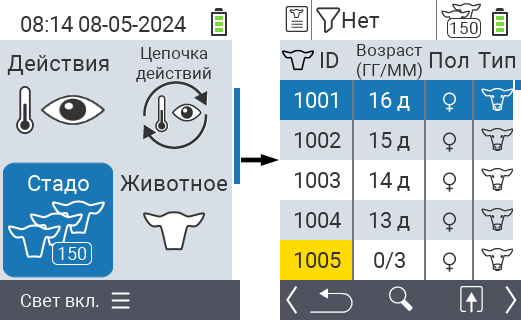
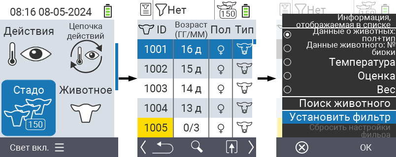
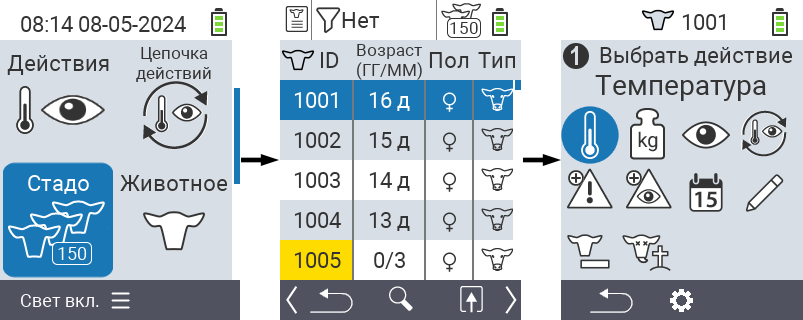

## Стадо

В пункте меню "Стадо" вы можете просмотреть всё ваше стадо, найти отдельных животных и отобразить важную информацию. У вас есть следующие возможности:

- Просмотр [данных о животных](#просмотр-данных-о-животных)
- Просмотр [данных о температуре](#отображение-температуры)
- Просмотр [данных о рейтинге](#просмотр-рейтинга)
- Просмотр [данных о весе](#отображение-веса)
- [Поиск животного](#поиск-животного)
- Установка [фильтра](#установить-фильтр)
- [Действия](#вызвать-меню-действий)

### Подготовительные шаги

1. На главном экране вашего устройства VitalControl выберите пункт меню  `Стадо` и нажмите кнопку `OK`.

2. Откроется обзор вашего стада.

    

### Просмотр данных о животных

1. Выполните подготовительные шаги.

2. Используйте клавишу `F3` &nbsp;&nbsp; для вызова всплывающего меню, в котором перечислены категории информации, которые можно отобразить для списка стада. Используйте стрелки △ ▽ для выделения строки `Данные о животных: пол + тип` или `Данные о животных: N0 бирка` и выберите эту категорию, нажав центральную кнопку `OK` или клавишу `F3` `OK`. Две опции выбора отличаются отображением информационной строки.

3. Данные о животных теперь будут отображаться в содержании списка стада.

4. Кроме того, вы можете использовать стрелки ◁ ▷ для переключения между различными вариантами отображения.

    

{}
По умолчанию сначала отображаются данные о животных. Только когда вы, например, отобразите вес, вам нужно будет снова установить отображение данных о животных.
{}

### Отображение температуры

1. Выполните подготовительные шаги.

2. Используйте клавишу `F3` &nbsp;&nbsp; для вызова всплывающего меню, которое отображает категории информации, доступные для списка стада. Используйте стрелки △ ▽ для выбора строки `Temperature` и выберите эту категорию, нажав центральную кнопку `OK` или клавишу `F3` `OK`.

3. Теперь данные о температуре будут отображаться в содержимом списка стада.

4. Кроме того, вы можете использовать стрелки ◁ ▷ для переключения между различными вариантами отображения.

    

### Просмотр рейтинга

1. Выполните подготовительные шаги.

2. Используйте клавишу `F3` &nbsp;&nbsp; для вызова всплывающего меню, которое отображает категории информации, доступные для списка стада. Используйте стрелки △ ▽ для выбора строки `Rating` и выберите эту категорию, нажав центральную кнопку `OK` или клавишу `F3` `OK`.

3. Теперь данные о рейтинге будут отображаться в содержимом списка стада.

4. Кроме того, вы можете использовать стрелки ◁ ▷ для переключения между различными вариантами отображения.

    

### Отображение веса

1. Выполните подготовительные шаги.

2. Используйте клавишу `F3` &nbsp;&nbsp; для вызова всплывающего меню, которое отображает категории информации, доступные для списка стада. Используйте стрелки △ ▽ для выбора строки `Weight` и выберите эту категорию, нажав центральную кнопку `OK` или клавишу `F3` `OK`.

3. Теперь данные о весе будут отображаться в содержимом списка стада.

4. Кроме того, вы можете использовать стрелки ◁ ▷ для переключения между различными вариантами отображения.

    

### Поиск животного

1. Выполните подготовительные шаги.

2. Используйте клавишу `F3` &nbsp;&nbsp; для вызова всплывающего меню, которое отображает различные опции. Используйте стрелки △ ▽ для выбора функции `Search animal` и активируйте функцию поиска, нажав центральную кнопку `OK` или клавишу `F3` `OK`. Кроме того, вы можете использовать кнопку `On/Off`  сразу после первого шага.

3. Используйте стрелки △ ▽ ◁ ▷ для ввода номера желаемого животного и подтвердите нажатием `OK`.

    

### Установить фильтр

1. Выполните подготовительные шаги.

2. Используйте клавишу `F3` &nbsp;&nbsp; для вызова всплывающего меню, которое предлагает различные опции. Используйте стрелки △ ▽ для выбора функции `Установить фильтр` и активируйте функцию фильтра нажатием центральной клавиши `OK` или клавиши `F3` `OK`.

3. Как применить фильтр, можно узнать [здесь]().

    

### Вызвать меню действий

У вас всегда есть возможность вызвать меню действий для животного.

1. Выполните подготовительные шаги.

2. Выберите животное из списка с помощью стрелок △ ▽ и подтвердите нажатием `OK`.

3. Теперь открыто меню действий. Как пользоваться этим можно узнать [здесь](../actions).

4. Вернитесь в список стада с помощью клавиши `F3`.

    
